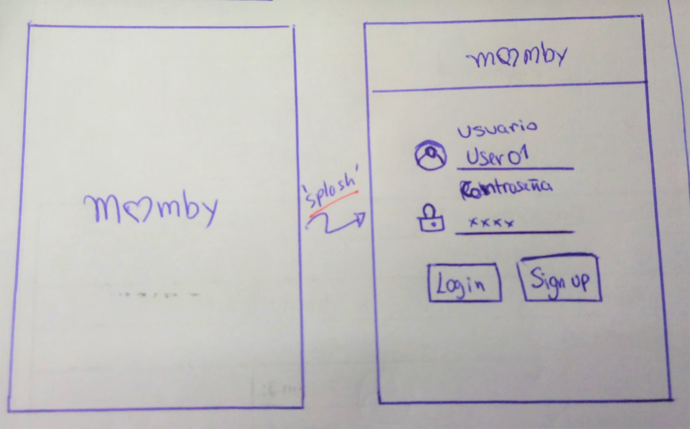
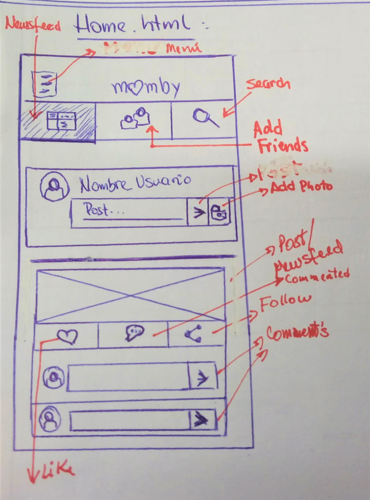
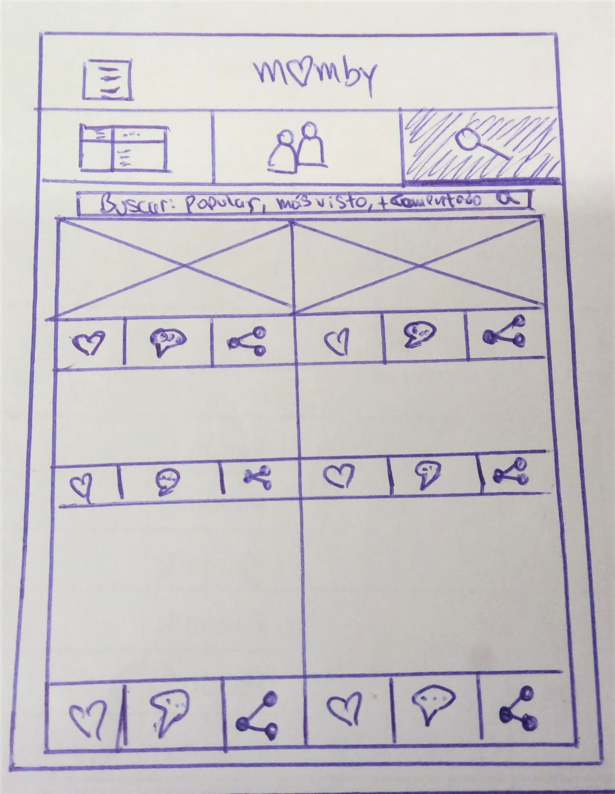
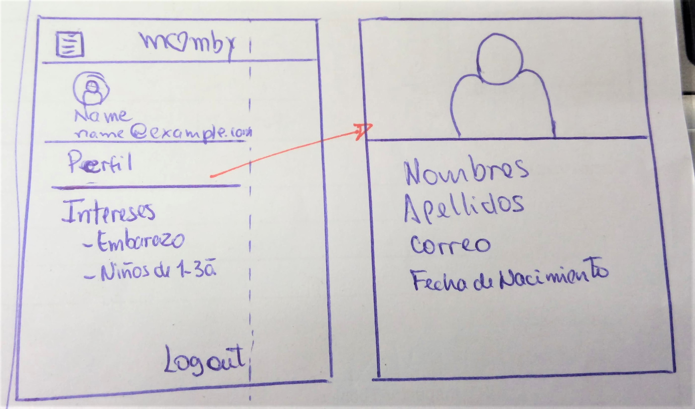

# Red social MOMBY

* **Track:** _Common Core_
* **Curso:** _Crea tu propia red social_
* **Unidad:** _Producto Final_

***

El presente repositorio contiene el producto final del Sprint 3 de nuesto _bootcamp_ en Laboratoria.

* El trabajo fue realizado por  _Gabriela Mamani y Molly Siesquén_.

* Se nos pide poner en práctica nuestros conocimientos de jQuery y la utilización de frameworks.

* Se realizó entre las fechas del Lunes 8 de Enero del 2017 al Miércoles 10 de Enero del 2018.

## Requerimientos

Nuestra versión final cumple con:

* Validación de usuario, register y log in, utilizando local storge.
* Un perfil de usuario.
* Un área de neewsfeed.
* Diseño mobile friendly.
* Filtros de contactos.
* Filtros de posts: Lo más visto, populares y más comentado.
* Desplegar el producto en Github Pages.
* Agregar comentarios al área de newsfeed.

## Flujo de trabajo

1. Se trabajó de forma colaborativa, llevando a cabo una planificación.

2. Luego de definir el tema de nuestra red social, realizamos sketchs que no sirvieron de guía durante la realización del proyecto (adjuntamos imágenes del sketch respectivo).

3. El sketch está realizado de acuerdo a las necesidades de los usuarios en nuestra red.

4. Se mostró el siguiente sketch a un usuario con el perfil que requería nuestra red social, para obtener un primer feedback.

5. Se mejoró el sketch inicial, y el resultado es el siguiente:

6. A continuación las vistas de nuestra red _MOMBY_:

## Integrantes

* Molly Siesquén

* Gabriela Mamani